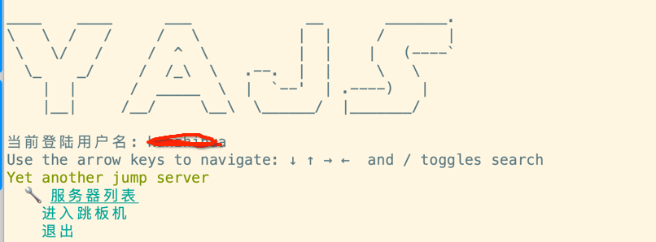
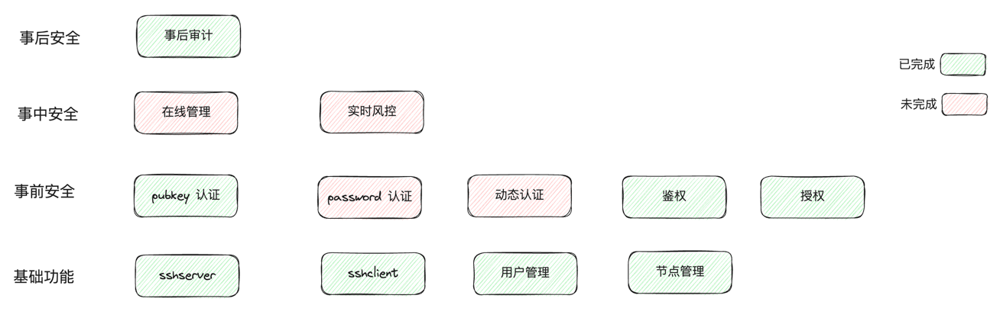

# yajs
Yet Another Jump Server

## 动机
生产环境中有几十台ecs服务器，很明显是需要一个跳板机来支撑日常运维工作，在github.com找了一些开源解决方案，并没特别合适的,
都需要花费一定时间做二次开发。

目前我的时间有点充裕，跳板机系统涉及到的技术，包括ssh协议、pty、shell，我也比较有兴趣，而且我对网络开发、数据安全有一定的经验，所以决定自己重新做一个。

## 系统功能
* 跳板机除去基本功能，更关注跳板机的安全
* 安全功能一个大头就是处理user、server、sshuser鉴权和授权，目前yajs主界面采用ui menu方式，所有menu需要一并考虑  
* yajs采用了casbin的表达是来处理三者关系及user和menu的关系

## 使用指南
使用指南相关的，请移步到[使用指南](doc/mds/USAGE.md).

## 系统设计
系统设计相关的，请移步到[系统设计](doc/mds/DESIGN.md).

## 遇到到问题
遇到到问题，请移步到[遇到到问题](doc/mds/FAQ.md).