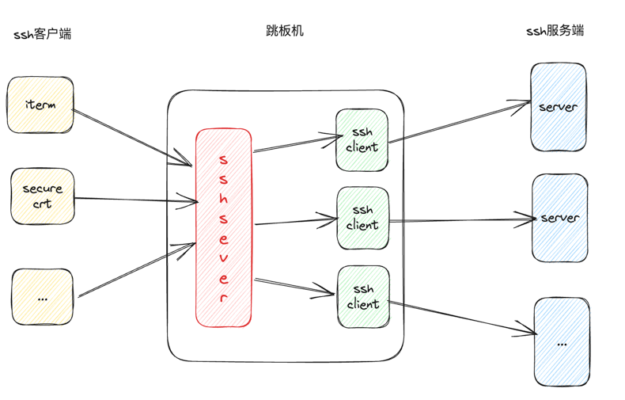

# yajs
Yet Another Jump Server

## 动机
生产环境中有几十台ecs服务器，很明显是需要一个跳板机来支撑日常运维工作，在github.com找了一些开源解决方案，并没特别合适的,
都需要花费一定时间做二次开发。
目前我的时间有点充裕，跳板机系统涉及到的技术，包括ssh协议、pty、shell，我也比较有兴趣，而且我对网络开发、数据安全有一定的经验，所以决定自己重新做一个。

## yajs 使用

### 前置要求
* 所有ecs需要统一的用户，比如每一个ecs包含一个root用户、一个web用户
* 所有ecs都需要安装、并启动opensshd
* 需要把跳板机的id_rsa.pub 同步到所有ecs对应用户的authorized_keys中，并保证从跳板机可以ssh到所有ecs上

_**这些工作应该是工程化，通常在装机初始化时完成。**_

### 配置文件
#### config.yaml
主配置文件，包括yajs用户、统一的ssh user、服务列表
```
users:
  - username: admin
  - username: 张三
  - username: 李四
sshusers:
  -
    username: root
    privateKeyFile: root_rsa
  -
    username: web
    privateKeyFile: web_rsa
servers:
  -
    name: saas01
    ip: 10.1.1.1
  -
    name: saas02
    ip: 10.1.1.2
    port: 22
    
```
其中servers也支持provider方式，目前提供了aliyun server provider，方式如下
```
server_provider:  aliyun
```

### 运行

## yajs 设计

### 跳板机基础功能
