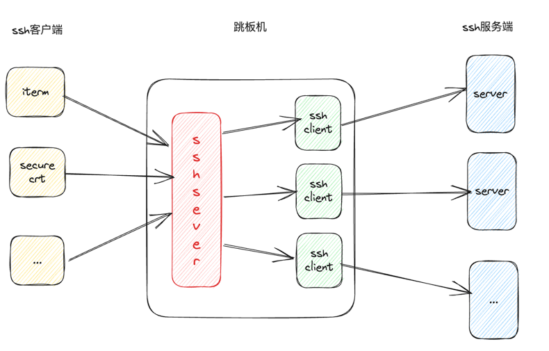
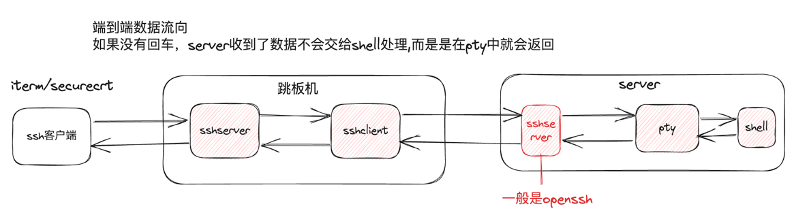

# 系统设计

## 跳板机初步印象

## 功能分解
系统功能主要包括以下：
* 基本功能：资源管理、sshserver、sshclient，（server中的sshserver一般不会涉及到，直接使用
openssh来实现）。
* 安全
* 性能、可用性、监控、运维 等通用非功能性需求

### 安全
* 登录：目前系统只实现pubkey登录
* 鉴权：使用casbin的表达式方式，来处理user、server、sshuser三者权限关系

### 背景知识
[ssh协议](doc/mds/SSHPROT.md).
